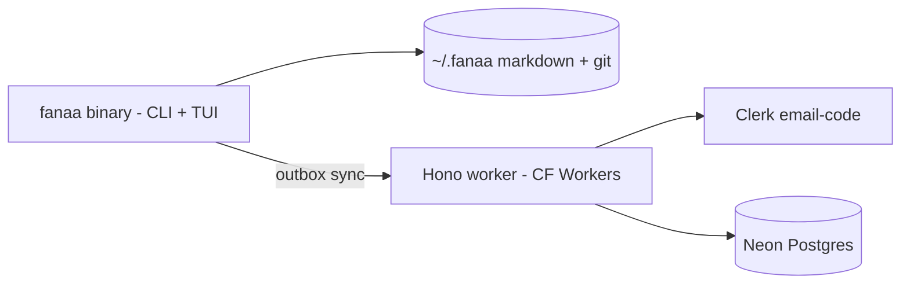

# Fanaa

Terminal-first daily journal — every entry is a letter, stamped with a date, addressed from a persona to a recipient, stored as plain markdown on your disk.


## Install

```bash
curl -fsSL https://raw.githubusercontent.com/FirozChauhan/fanaa/main/install.sh | sh
```

Installs the latest release to `~/.local/bin/fanaa` (Linux/macOS, x64/arm64). From source:

```bash
git clone https://github.com/FirozChauhan/fanaa && cd fanaa
bun install && bun run build   # single static binary
```

## Usage

```bash
fanaa                      # asks for a subject, opens vim on the body
fanaa tui                  # full-window TUI: a compose, e edit, d delete
fanaa add "milk, eggs"     # quick capture
fanaa yesterday            # read letters as email
fanaa ls                   # list recent letters
fanaa login you@mail.com   # cloud sync (email code)
fanaa sync                 # push local, pull cloud
```

## Features

- One letter = one file, git history per journal — edits and deletes are recoverable revisions
- Personas: `--from` / `--to` costume changes per letter, `fanaa -v` for defaults
- Local-first: cloud is only ever a backup; offline writes queue in an outbox
- Backdating (`--date`), multiple journals (`--cat work`), vim as the editor (git-commit style)

## Environment Variables

```bash
FANAA_EDITOR=nano      # optional — override vim as the letter editor
FANAA_API_URL=         # optional — point CLI at a specific sync server
```

## Architecture



Local letters are the source of truth; sync is last-write-wins with tombstone deletes.

## Development

```bash
bun install
bun run build          # → ./fanaa binary
```

Bun workspace: `packages/` holds `cli`, `tui`, `core`, `sync`, `api`.

## License

Private — all rights reserved.
